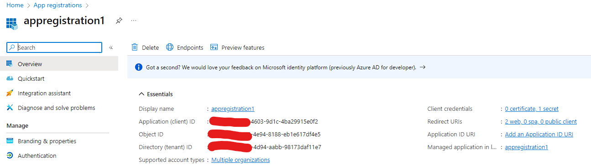
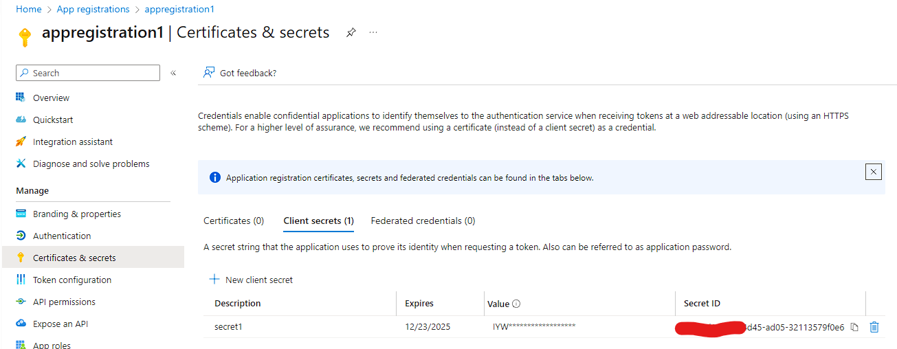
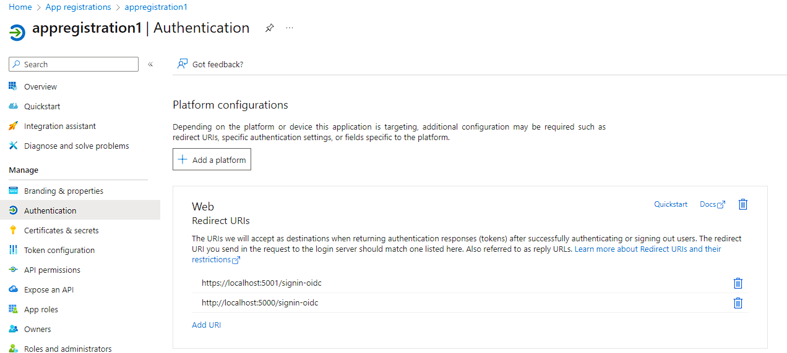
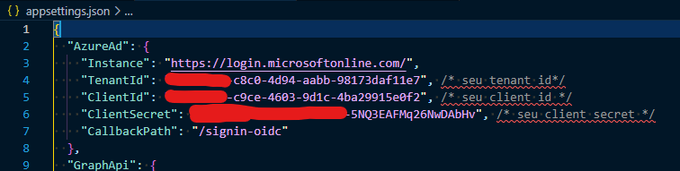
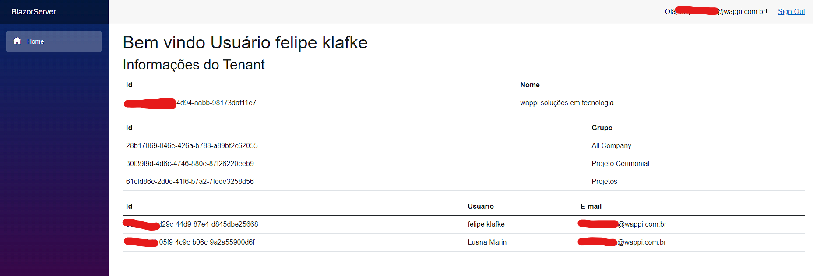

# Demo de apresentação do uso do Microsoft Entra Id numa aplicação Blazor

## Pré-requisitos no Azure

### Registrar um aplicativo de acordo com a imagem abaixo

### Registrar um secret

### Adicionar a plataforma necessária, no nosso caso será web

## Pré-requisitos na aplicação

### Seus dados no appsettings devem ficar assim

## Por fim

Basta executar o projeto recuperado do github na sua máquina utilizando o comando "dotnet run"

## Aplicação funcionando

